# Naftal Khadamat (Unofficial)

 

### هذا التطبيق قيد التطوير 🟠

**نفتال خدمات** هو تطبيق محمول يعتمد على Flutter، تم تطويره بواسطة متدربي شركة نفتال سبا، ويتميز بنسخة غير رسمية محسّنة من المنصة الأصلية. يعرض هذا المشروع مهاراتنا في تحديث وتوسيع الوظائف للاستخدام عبر المنصات المختلفة.

---

### ✨ الميزات

- متعدد المنصات (iOS، Android)
- واجهة مستخدم حديثة ومتجاوبة
- عرض خريطة تفاعلية
- تقديم طلبات الخدمة
- تم بناؤه باستخدام Flutter 3.19.x

### 📸 لقطات الشاشة

إليك نظرة سريعة على التطبيق:

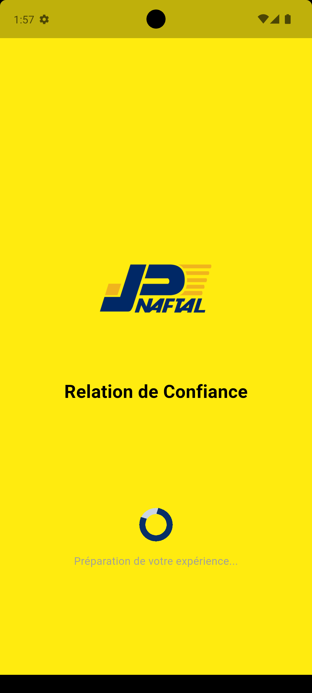 
  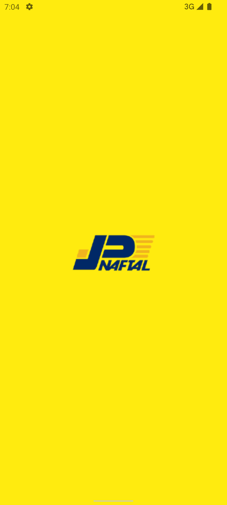
   
  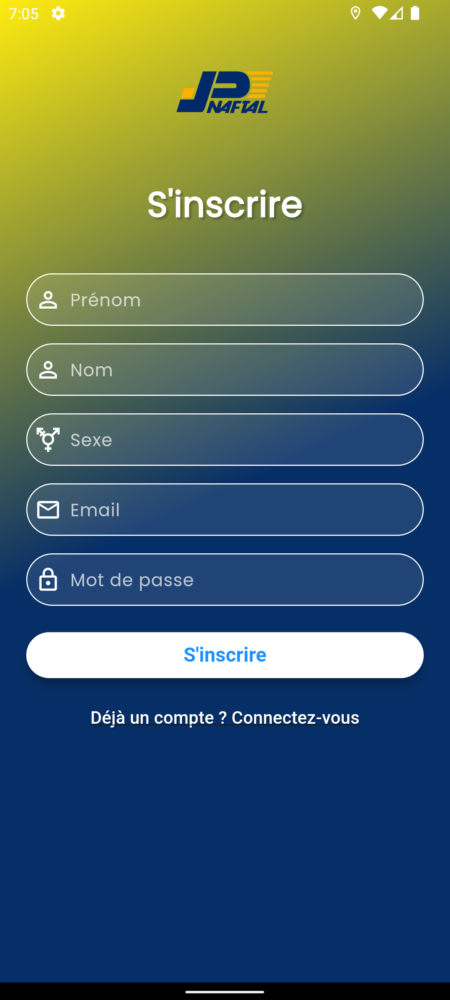 
 

  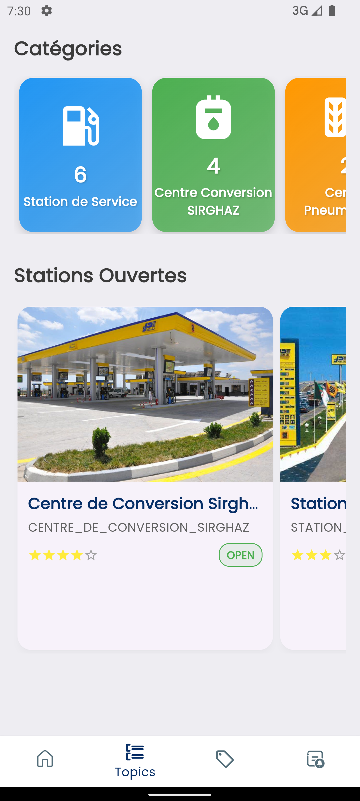 
  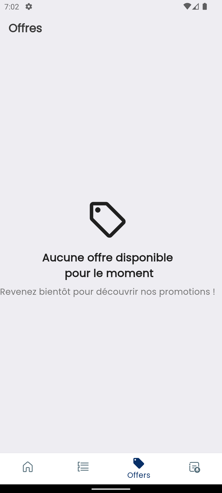 
  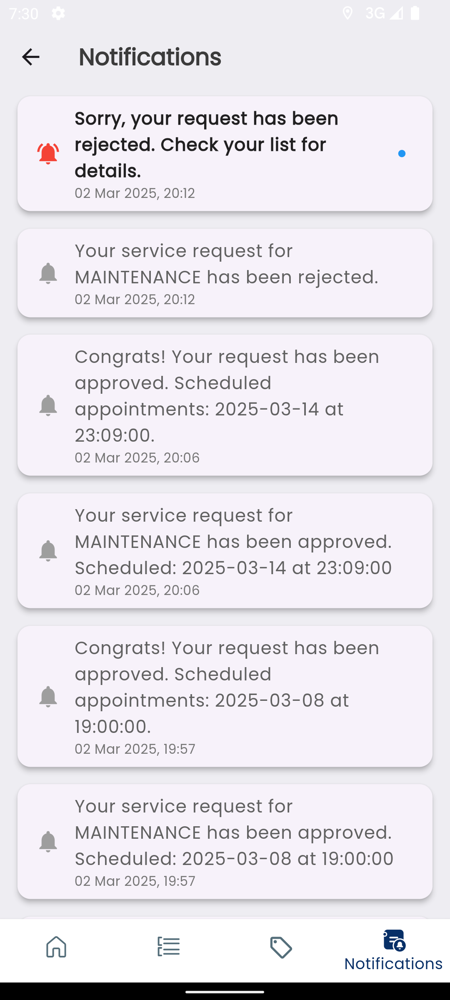 
  

  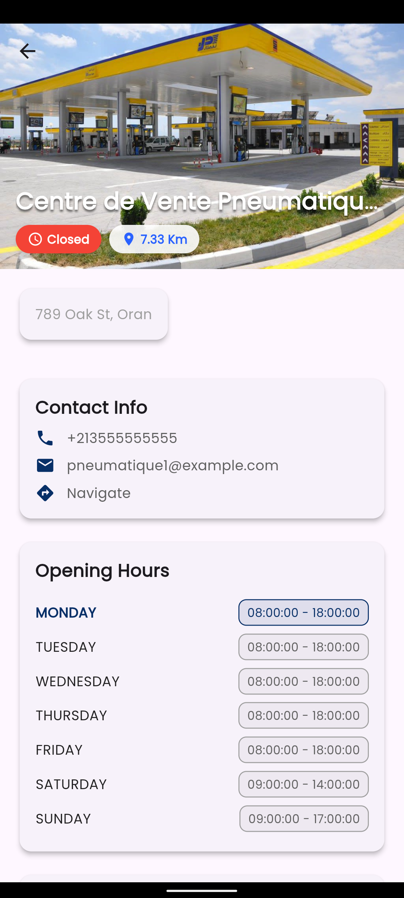 
  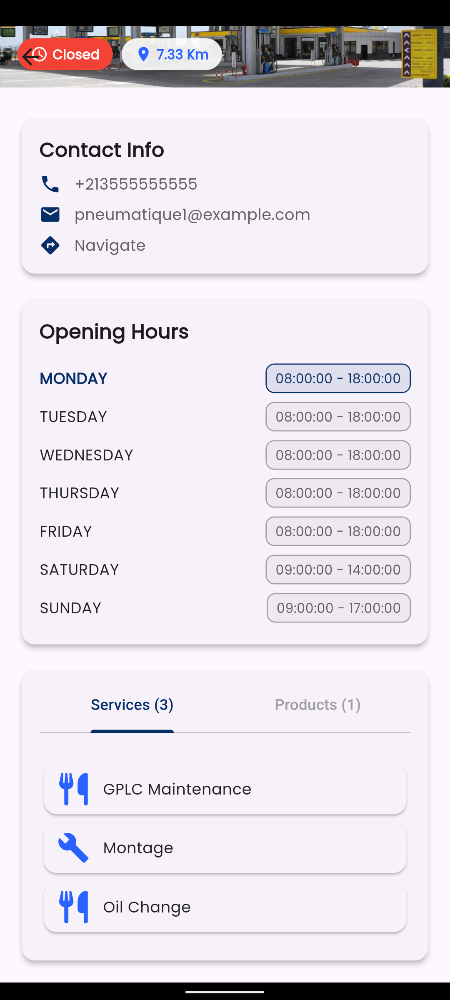 
  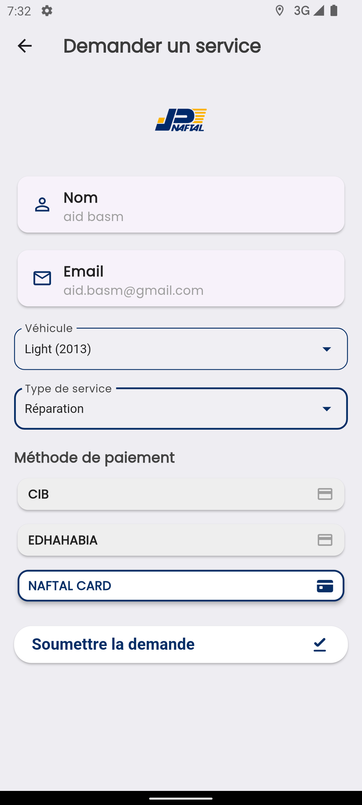 
  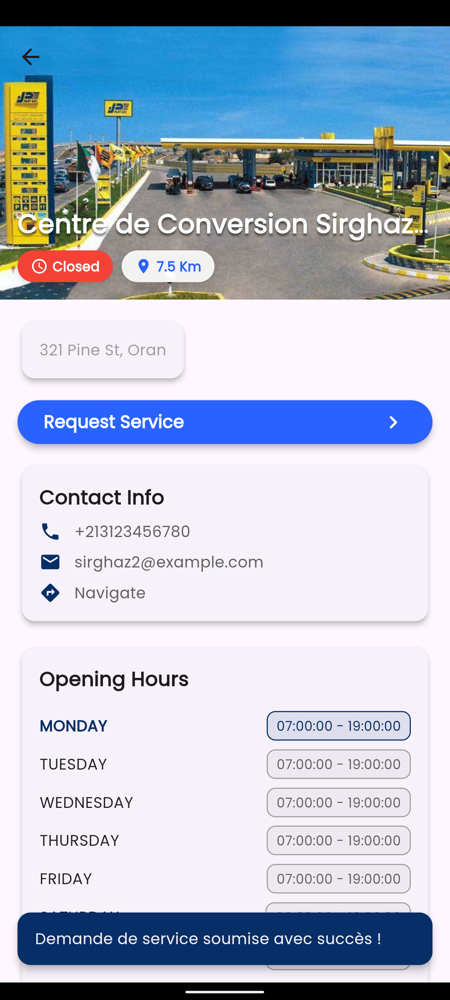

  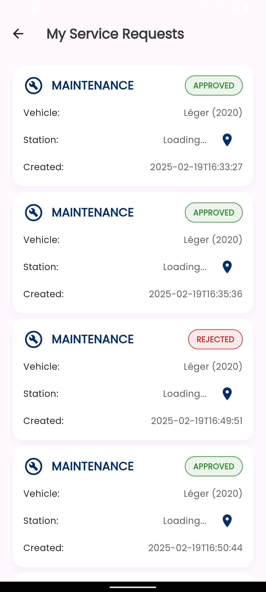 
  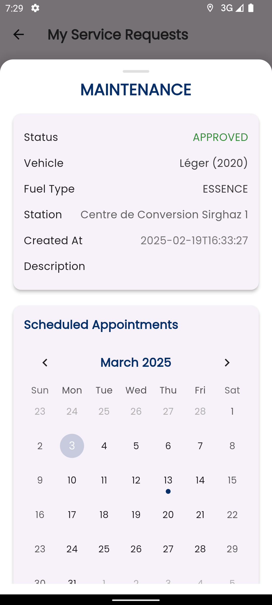 
   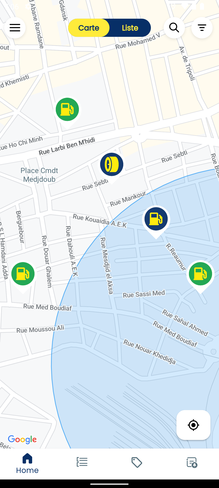 
  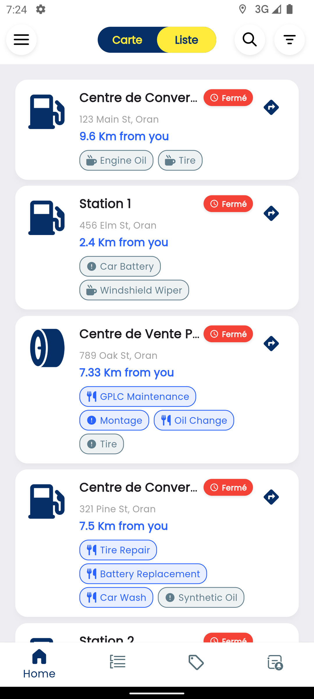
  

> **ملاحظة:** يتم تخزين لقطات الشاشة في مجلد `screenshots/`.

---

### 🛠️ التقنيات المستخدمة

- **التطبيق المحمول:** Flutter 3.x
- **الخلفية/واجهة برمجة التطبيقات:** Spring Boot 3.x | Openjdk-21
- **قاعدة البيانات:** MariaDB 10.x
- **المنصات:** iOS، Android

### 📜 الترخيص

هذا المشروع برمجيات مملوكة لـ [@abdelillahbel](https://github.com/abdelillahbel) و [@Benraouf93](https://github.com/Benraouf93). جميع الحقوق محفوظة. يُمنع النسخ أو التوزيع أو الاستخدام غير المصرح به. انظر ملف `LICENSE` للتفاصيل.

---

تم تطويره بواسطة متدربي شركة نفتال سبا – فبراير 2025
