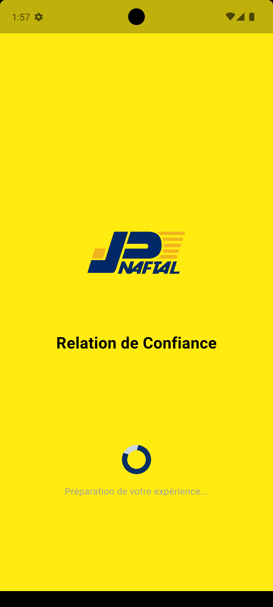
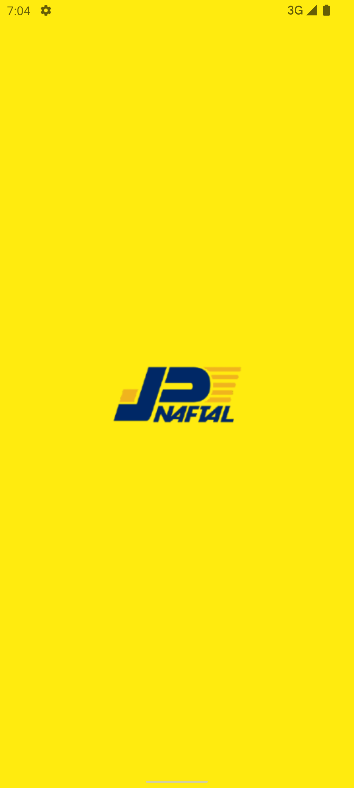
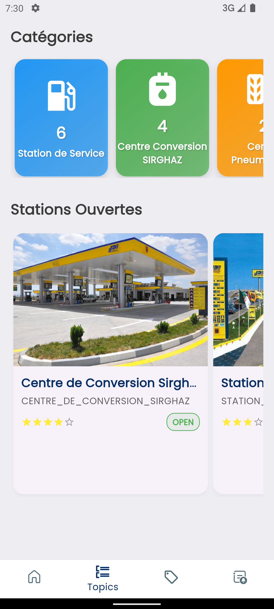
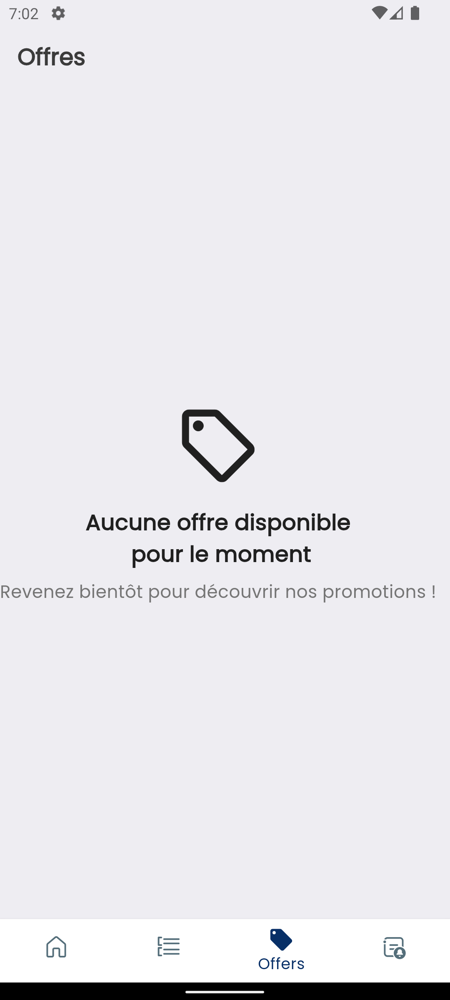
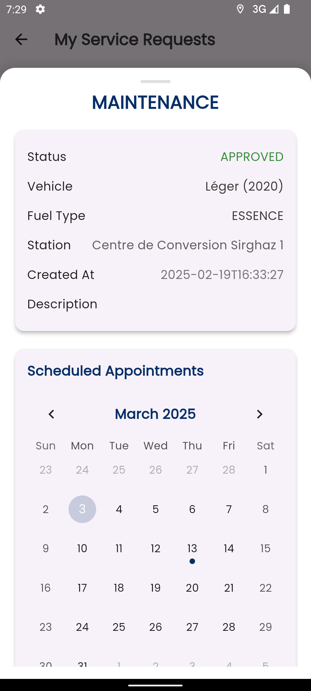
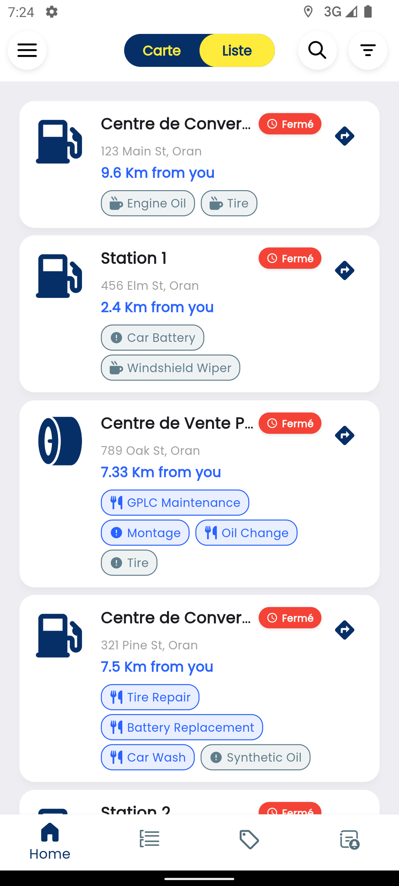

# Naftal Khadamat (Unofficial)

 

### Cette application est en cours de développement 🟠

**Naftal Khadamat** est une application mobile basée sur Flutter, développée par les stagiaires de Naftal Spa, offrant une version non officielle améliorée de la plateforme originale. Ce projet met en avant nos compétences dans la modernisation et l'expansion des fonctionnalités pour une utilisation multiplateforme.

---

### ✨ Fonctionnalités

- Multiplateforme (iOS, Android)
- Interface utilisateur réactive et moderne
- Vue cartographique interactive
- Soumission de demandes de service
- Construit avec Flutter 3.19.x

### 📸 Captures d’écran

Voici un aperçu rapide de l’application :

 
  
   
   
 

   
   
   
  

   
   
   
  

   
   
    
  
  

> **Note :** Les captures d’écran sont stockées dans le dossier `screenshots/`.

---

### 🛠️ Pile technologique

- **Application mobile :** Flutter 3.x
- **Back-end/API :** Spring Boot 3.x | Openjdk-21
- **Base de données :** MariaDB 10.x
- **Plateformes :** iOS, Android

### 📜 Licence

Ce projet est un logiciel propriétaire appartenant à [@abdelillahbel](https://github.com/abdelillahbel) & [@Benraouf93](https://github.com/Benraouf93). Tous droits réservés. Toute copie, distribution ou utilisation non autorisée est interdite. Voir le fichier `LICENSE` pour plus de détails.

---

Développé par les stagiaires de Naftal Spa – Février 2025
