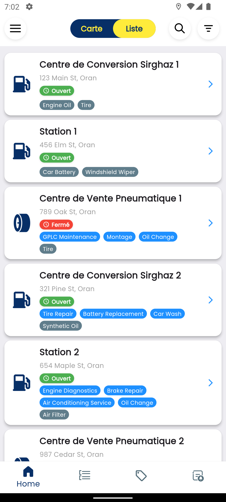
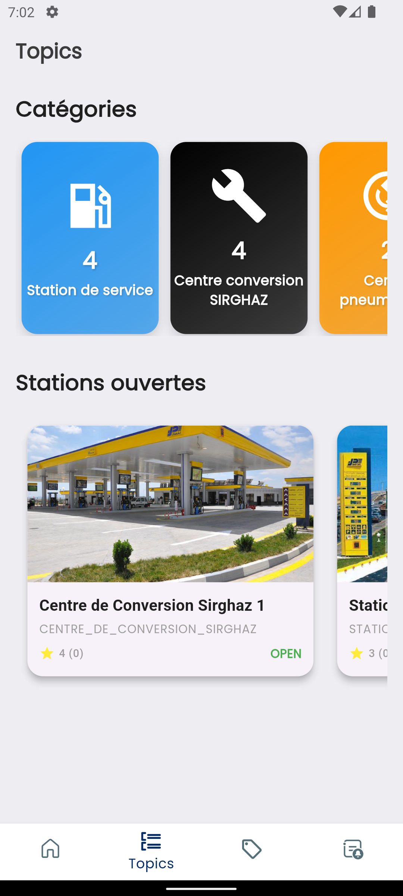
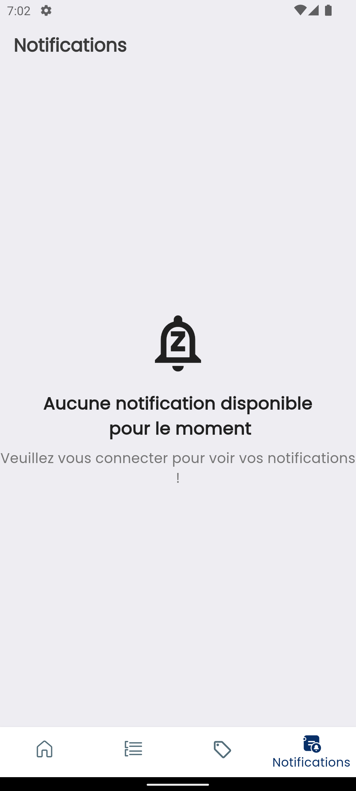

# Naftal Khadamat (Unofficial)

## This app is under development 🟠

**Naftal Khadamat** is a Flutter-based mobile app developed by Naftal Spa interns, featuring an enhanced unofficial version of the original platform. This project showcases our skills in modernizing and expanding functionality for cross-platform use.

---

## ✨ Features

- Cross-platform (iOS, Android)
- Responsive, modern UI
- Interactive map view
- Service request submission
- Built with Flutter 3.19.x

## 📸 Screenshots

Here’s a quick look at the app:

   
   
   
  

   
   
   
  

> **Note:** Screenshots are stored in the `screenshots/` folder.

---

## 🛠️ Tech Stack

- **Framework:** Flutter 3.19.x
- **Language:** Dart 3.3.x
- **Platforms:** iOS, Android

## 📜 License

This project is proprietary software owned by [@abdelillahbel](https://github.com/abdelillahbel) & [@Benraouf93](https://github.com/Benraouf93). All rights are reserved. Unauthorized copying, distribution, or use is prohibited. See the `LICENSE` file for details.

---

Developed by Naftal Spa Interns – February 2025